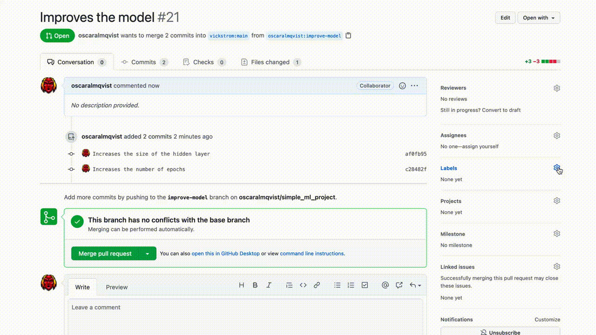

This tutorial aims to automate the evaluation of a Machine Learning repository using webhooks on __GitHub__. The process of evaluating the effect of particular on the training set is tedious, especially if you weren't the author. This tutorial will teach how you automate the testing process for a specific pull request assigned to a certain label, and comment then results on the respective pull request

## Showcase 
    