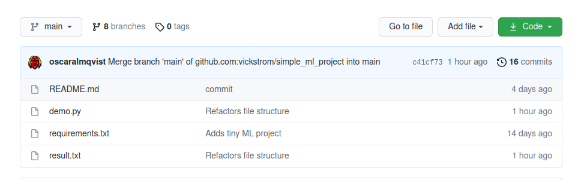

## Showcase 
    

### Prerequisites

- A GitHub account
- A public GitHub repository containing a machine learning model. 
  - We have included our own which you can add to your repository. See section below. 
   

### The Machine Learning Project Structure
In this tutorial we're using Python along with the [Keras](https://keras.io/) and [Tensorflow](https://www.tensorflow.org/) libraries to create a simple model to classify digits from the MNIST dataset. This can of course be modified to your own setup, but for the sake of the tutorial, we have included a folder containing a model located [here](./code/ml). This includes instructions on how to run it. For simplicity sake, we download the MNIST using [`keras.datasets`](https://www.tensorflow.org/api_docs/python/tf/keras/datasets/mnist/load_data). 

Essentially, the included code does the following steps:     
* Downloads the dataset,
* Preprocesses the data,
* Creates the model,
* Compiles the model,
* Trains the model,
* Evaluates it. 

After all of these steps are done, it saves the result to a file to a folder. In our case, it is saved as `result.txt` with a JSON object containing the loss and accuarcy.
```python
# result.txt
{'loss': 1, 'accuracy': 1}
```
> ⚠️  Remember that the results file produced from the model must match the file that the server is supposed to read from! ⚠️  

> __NOTE:__ The `demo.py` and `requirements.txt` should be at the root of the repository
>  


### Tutorial Outline

The generel steps to complete our goal is described below. In further sections, there will be more detailed instructions.

1. A server that listens on pull request events.   

    For every event on GitHub, you have the option to specify an HTTP endpoint where you want to retrieve data regarding the event. In our case, we want to listen to the event of creation of a pull request. To listen, we need to create a webserver than listens for a __PUSH event__ for a specific endpoint. To be able to specify which endpoint and later on access the [GitHub API](https://docs.github.com/en/rest), we need to install our own [GitHub App](https://docs.github.com/en/developers/apps) on the specific repository.
   
2. Evaluate the model inside the pull request.  
   The data in the __PUSH event__ contains the necessary information to evaluate the changes in the pull request. With this, we will clone the repository, evaluate and compare both the __HEAD__ and the __BASE__ of the pull request. Then we train and test the model against the test sets for each version of the code. This will be done by executing shell-commands via Python.

3. Comment the results   
   The result from the evaluation will be sent as comment on a pull request via the [GitHub API](https://docs.github.com/en/rest). To do this, we need to authenicate via our [GitHub App](https://docs.github.com/en/developers/apps). 

<!--- __PROOF OF CONCEPT__ AND SHOULD NOT BE USED IN __PRODUCTION__. --->

> ⚠️ The application created assumes that the code in the pull request is safe, if an unauthorized person decide to put in faulty code, it would run on your server. Proper security measures needs to be added. ⚠️️️️️

Lets start!
`