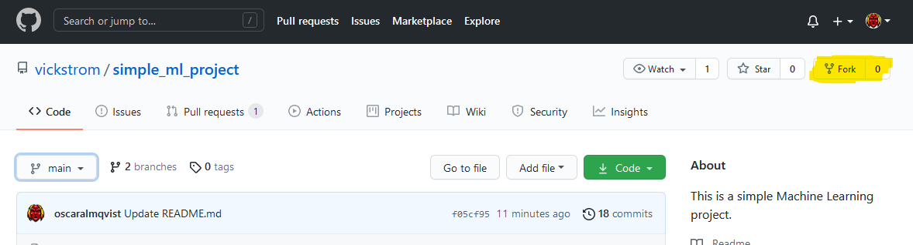

In this tutorial we're using Python along with the [Keras](https://keras.io/) and [Tensorflow](https://www.tensorflow.org/) libraries to create a simple model to classify digits from the MNIST dataset. This can of course be modified to your own setup, but for the sake of the tutorial, we have included a folder containing a model located [here](https://github.com/vickstrom/automation-of-model-evaluation/tree/main/code/ml). This includes instructions on how to run it. For simplicity sake, we download the MNIST using [`keras.datasets`](https://www.tensorflow.org/api_docs/python/tf/keras/datasets/mnist/load_data). 

Essentially, the included code does the following steps:     
* Downloads the dataset,
* Preprocesses the data,
* Creates the model,
* Compiles the model,
* Trains the model,
* Evaluates it. 

After all of these steps are done, it saves the result to a file. In our case, it is saved as `result.txt` with a JSON object containing the loss and accuarcy.
```python
# result.txt
{'loss': 1, 'accuracy': 1}
```
> ⚠️  Remember that the results file produced from the model must match the file that the server is supposed to read from! ⚠️  

> If you don't have a repository where you want to implement this, fork our [small demo](https://github.com/vickstrom/simple_ml_project). The `demo.py` and `requirements.txt` should be at the root of the repository. Also, we have included a branch where we have made some changes. This will be used later to create a pull request with.




> __Additionally__, add an `evaluate` label to the repository as this will be our flag for showing when to run our evaluation.

An example of how our project looks like:    
