Now we need to create a GitHub App and install in on our machine learning repository. Why you might ask? 🧐 Webhooks can be configured without an app, however commenting on our pull request requires us to communicate via GitHub. So lets create an App. First navigate to their [app page](https://github.com/settings/apps).

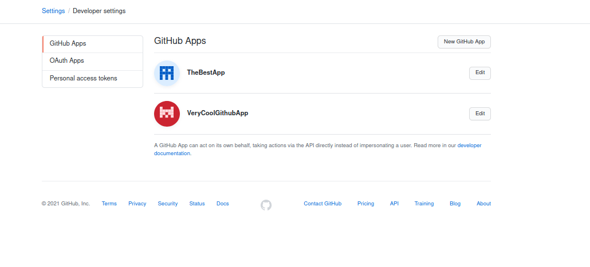

Click __New GitHub App__.

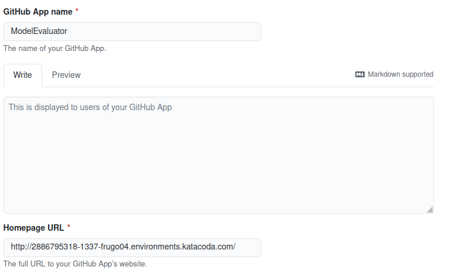

We need to specify a name for our app. However, they require you to specify a website. No website? Here we could simply input the url generated by katacoda.  

`http://[[HOST_SUBDOMAIN]]-1337-[[KATACODA_HOST]].environments.katacoda.com/`.

We are using the default settings for all the options (_Identifying and authorizing users_, _Post installations_, etc.), expect for the following:

### Identifying and authorizing users

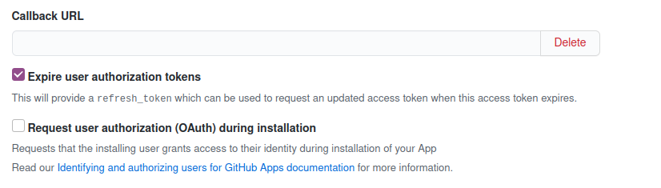

### Post installation

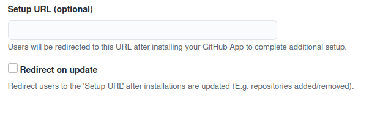

### Webhook
Here, we will input the endpoint to our server with the added `/mlops-server` extension.

`http://[[HOST_SUBDOMAIN]]-1337-[[KATACODA_HOST]].environments.katacoda.com/mlops-server`.

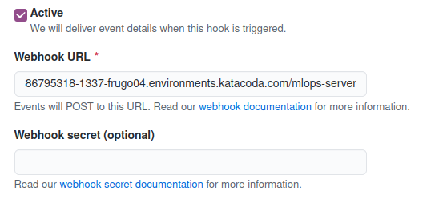

### Repository permissions
Tell GitHub, that we need access to every pull-request where we install our App.

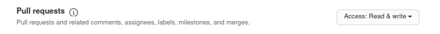

### Subscribe to events
For the webhook, we want to listen to specific request regarding pull-requests. 

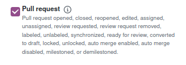

### Where to install 
We do not plan to install this everywhere and only for our repo. 

Click create. Voilá, we have our first App. 🥳

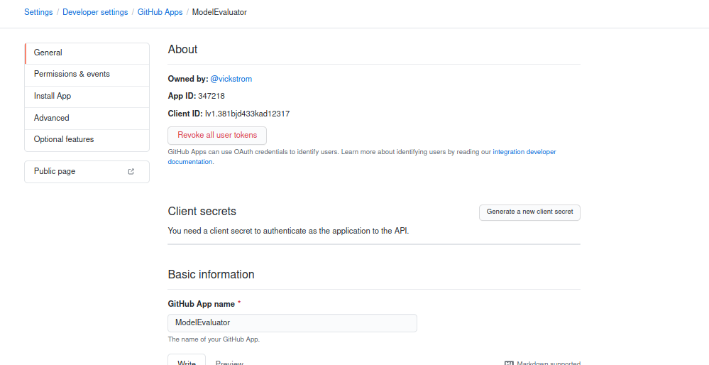

Save the __App ID__ inside `.env`{{open}} after the equals sign with your own __App ID__:
<pre class="file">
APP_ID=6329884
</pre>

### Get private key
In the future, we need to authenticate as the app through our server, so generate a private-key! This is found at the bottom of the same page.

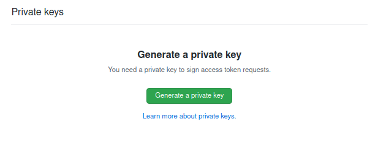

Download it and copy its content.  

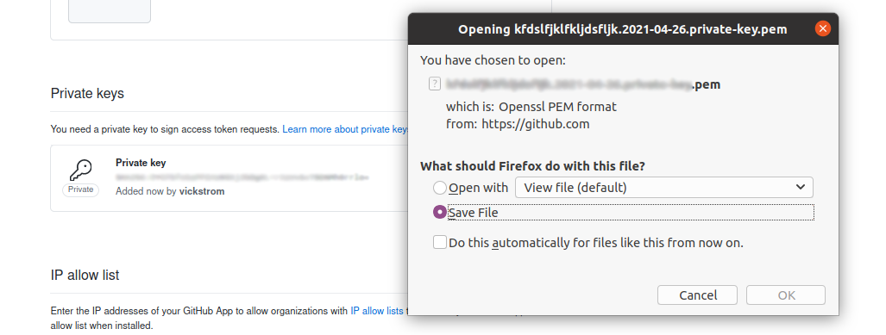
Let's create a file for storing it: `private-key.pem`{{open}}. Copy the contents of the key to that file. Additionally, save the path to the key inside `.env`{{open}}.  

<pre class="file">
APP_ID=6329884
PRIVATE_KEY_PATH=private-key.pem
</pre>

### Install the app

Scroll up, and click on __Install App__. 

Choose that you want to install the app for one of your repositories. 

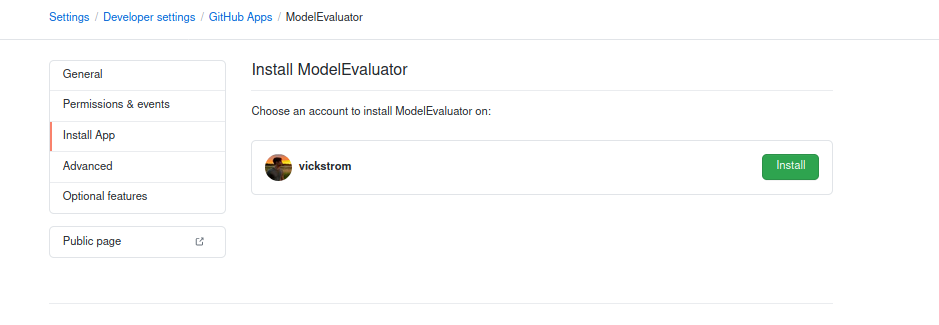

Here, select your machine learning repository. Hopefully, your project name is more exciting that `your-ml-project`.

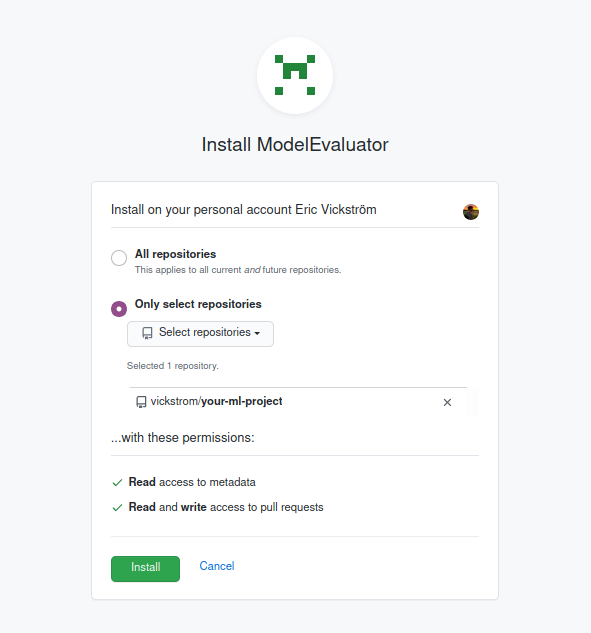

Click on __Install__.

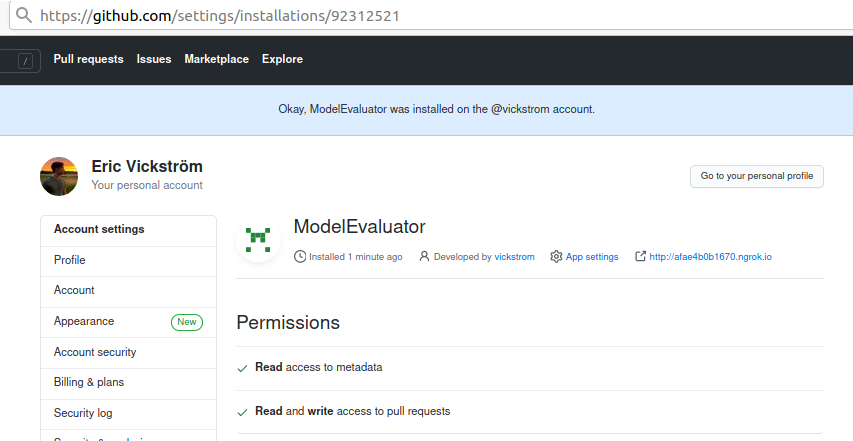

Look 👀 See the installation ID in the url? This ID is used when we want to specify which repository we want to add a comment to. Save that to `.env`{{open}} as well. Now it should look similar to this (again, with your own __APP_ID__ and __INSTALL_ID__):

<pre class="file">
APP_ID=6329884
PRIVATE_KEY_PATH=private-key.pem
INSTALL_ID=92312521
</pre>

Wow, that was a lot of steps.😮‍💨 The good news are that we're done with registrering the GitHub App. Let's continue with our server!