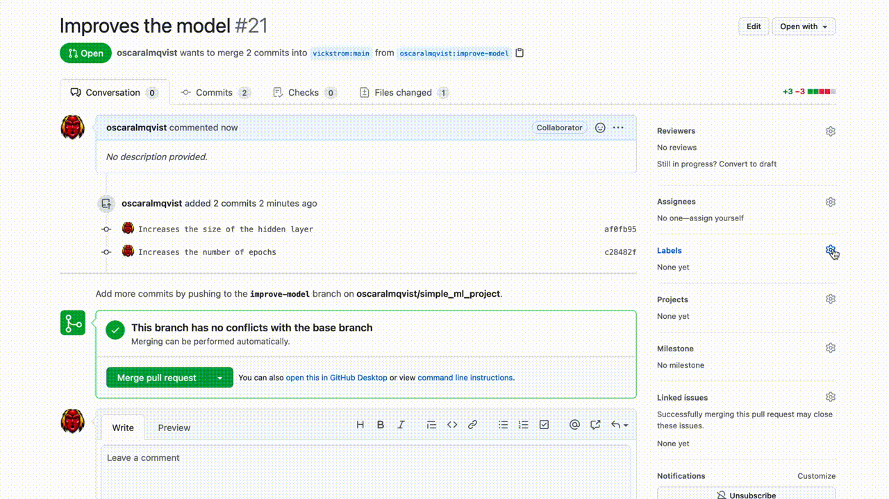

We have installed dependencies such as `tensorflow`, `numpy` in the background.

Start your server `python3 server.py`{{execute}}.

Now create a pull request to your ml-repo and add the label. You should expect:

    

Here is the final code, if something has gone wrong, you may use this version to see the final result:

<pre class="file" data-filename="server.py" data-target="replace">
from flask import Flask, request
from dotenv import load_dotenv
import requests
import json
import subprocess
import uuid
import time
import jwt
import os

load_dotenv()

INSTALL_ID = os.getenv('INSTALL_ID')
APP_ID = os.getenv('APP_ID')
PRIVATE_KEY_PATH = os.getenv('PRIVATE_KEY_PATH')

def generate_jwt():
    pemfile = open(PRIVATE_KEY_PATH, 'r')
    key = pemfile.read()
    pemfile.close()
    payload = {
        "iat": int(time.time() - 60),
        "exp": int(time.time() + (10 * 60)) - 10,
        "iss": APP_ID
    }
    return jwt.encode(payload, key, algorithm="RS256") 

def evaluate_pull_request(commit_sha, ssh_url):
    project_dst =  uuid.uuid4().hex
    subprocess.run(["git", "clone", ssh_url, project_dst], stderr=subprocess.DEVNULL)
    subprocess.run(["git", "checkout", commit_sha], cwd=f"./{project_dst}", stderr=subprocess.DEVNULL)
    subprocess.run(["pip3", "install", "-r", f"{project_dst}/requirements.txt"], stderr=subprocess.DEVNULL, stdout=subprocess.DEVNULL)
    subprocess.run(["python3", f"{project_dst}/demo.py"], stderr=subprocess.DEVNULL)
    subprocess.run(["rm", "-rf", project_dst])
    
    with open(f"result.txt", "r") as f:
        return json.load(f) 

GITHUB_APP_URL = "https://api.github.com/app"

def get_token():
    headers = {
        "Authorization": f"Bearer {generate_jwt()}",
        "Accept": "application/vnd.github.v3+json"
    }
    r = requests.post(f"{GITHUB_APP_URL}/installations/{INSTALL_ID}/access_tokens", headers=headers)
    return r.json()["token"]

def format_markdown_comment(head, base):
    diff_loss = round(head['loss'] - base['loss'], 2)
    diff_acc = round(head['accuracy'] - base['accuracy'], 2)

    diff_loss = f"+{diff_loss}" if diff_loss >= 0 else f"{diff_loss}"
    diff_acc = f"+{diff_acc}" if diff_acc>= 0 else f"{diff_acc}"

    rows = [
        f"| Source| Loss           | Accuracy            |",
        f"| ------| ---------------| ------------------- |",
        f"| Head  | {head['loss']} | {head['accuracy']}% |",
        f"| Base  | {base['loss']} | {base['accuracy']}% |",
        f"| Diff  | {diff_loss}    | {diff_acc}%         |"
    ]
    return "\n".join(rows)

def post_message_on_pull_request(comments_url, token, message):
    headers = {
        "Authorization": f"token {token}",
        "Accept": "application/vnd.github.v3+json"
    }
    payload = {
        "body": message
    }

    requests.post(comments_url, headers=headers, data=json.dumps(payload))

def is_valid_response(data):
    is_valid = False
    keys = data.keys()
    if 'pull_request' in keys and 'action' in keys:
        if data['action'] != 'labeled':
             return False 
        
        for label in data['pull_request']['labels']:
            if 'evaluate' == label['name']:
                is_valid = True 

    return is_valid 

def get_commits(data):
    return  data["pull_request"]["head"]["sha"], \
            data["pull_request"]["base"]["sha"]

def get_urls(data):
    return data["pull_request"]["comments_url"], \
           data["pull_request"]["head"]["repo"]["html_url"], \
           data["pull_request"]["base"]["repo"]["html_url"]

app = Flask(__name__)

@app.route('/mlops-server', methods=['POST'])
def mlops_server_endpoint():
    response = request.get_json()

    if is_valid_response(response):
        sha_head, sha_base = get_commits(response)
        comments_url, url_head, url_base = get_urls(response)

        head_result = evaluate_pull_request(sha_head, url_head)
        base_result = evaluate_pull_request(sha_base, url_base)

        message = format_markdown_comment(head_result, base_result)

        token = get_token()
        post_message_on_pull_request(comments_url, token, message)
    return 'Awaiting POST'

if __name__ == '__main__':
    app.run(host='0.0.0.0', debug=False, port=1337)
</pre>

